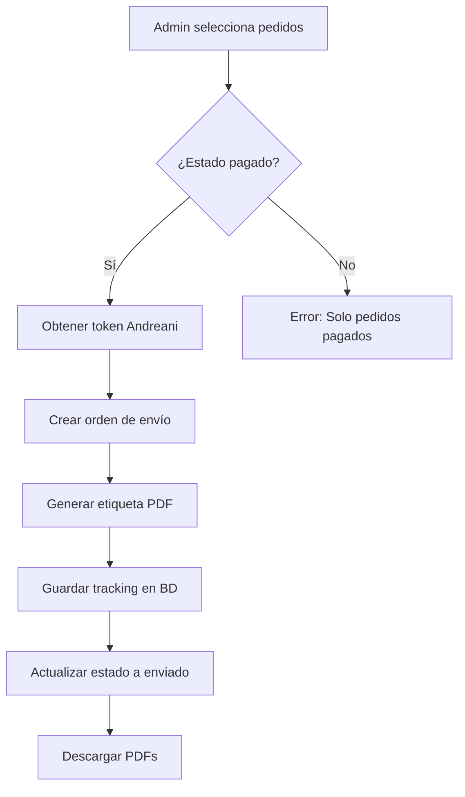

# 📦 Generación de Etiquetas Andreani - Guía de Uso

## 🎯 Flujo Completo



## 🛠️ Ejemplos de Uso

### 1. Generar Etiquetas para Múltiples Pedidos

```javascript
// En el componente AdminPedidos
const pedidosIds = ['673abc123...', '673def456...', '673ghi789...'];
const resultado = await handleGenerarAndreani(pedidosIds);

// Resultado esperado:
{
  mensaje: "Se procesaron 3 de 3 pedidos",
  exitosos: 3,
  fallidos: 0,
  etiquetas: [
    {
      pedidoId: "673abc123...",
      trackingCode: "AND12345678",
      etiqueta: "base64_pdf_data...",
      mensaje: "Etiqueta generada exitosamente"
    },
    // ... más etiquetas
  ]
}
```

### 2. Verificar Estado de un Pedido

```javascript
// GET /api/etiquetasAndreani?pedidoId=673abc123...
const response = await fetch('/api/etiquetasAndreani?pedidoId=673abc123...');
const data = await response.json();

// Respuesta:
{
  pedidoId: "673abc123...",
  trackingCode: "AND12345678",
  etiqueta: "base64_string...",
  estado: "enviado"
}
```

### 3. Estructura del Pedido (Order Model)

```javascript
{
  _id: "673abc123...",
  usuarioInfo: {
    nombreCompleto: "Juan Pérez",
    correo: "juan@email.com",
    telefono: "1155551234"
  },
  direccionEnvio: {
    codigoPostal: "1636",
    provincia: "Buenos Aires",
    ciudad: "Olivos",
    calle: "Av. Libertador",
    numero: "5678",
    piso: "3",
    depto: "B",
    telefono: "1155551234",
    entreCalles: "Entre Corrientes y Belgrano",
    referencia: "Portón verde"
  },
  items: [
    {
      nombreProducto: "Starlink Kit Standard",
      cantidad: 1,
      precioUnitario: 299900
    }
  ],
  tipoFactura: {
    tipo: "B",
    cuit: "20123456789",
    razonSocial: "Juan Pérez"
  },
  estado: "pagado", // Debe ser "pagado" para generar etiqueta
  total: 299900,
  trackingCode: "", // Se llenará automáticamente
  etiquetaEnvio: "" // Se llenará automáticamente con base64
}
```

## 🔧 Funciones Disponibles

### `handleGenerarAndreani(pedidosIds)`

Genera etiquetas para uno o múltiples pedidos.

**Parámetros:**
- `pedidosIds` (Array<string>): Array de IDs de pedidos

**Retorna:**
```javascript
{
  mensaje: string,
  exitosos: number,
  fallidos: number,
  etiquetas: Array<{
    pedidoId: string,
    trackingCode: string,
    etiqueta: string, // base64
    mensaje: string
  }>,
  errores?: Array<{
    pedidoId: string,
    error: string
  }>
}
```

### API Endpoints

#### POST `/api/etiquetasAndreani`

Genera etiquetas para los pedidos especificados.

**Request Body:**
```json
{
  "pedidos": ["673abc123...", "673def456..."]
}
```

**Response (200):**
```json
{
  "mensaje": "Se procesaron 2 de 2 pedidos",
  "exitosos": 2,
  "fallidos": 0,
  "etiquetas": [
    {
      "pedidoId": "673abc123...",
      "trackingCode": "AND12345678",
      "etiqueta": "JVBERi0xLjQKJe...",
      "mensaje": "Etiqueta generada exitosamente"
    }
  ]
}
```

**Response (400 - Error):**
```json
{
  "error": "No se encontraron pedidos válidos (deben estar en estado 'pagado')"
}
```

#### GET `/api/etiquetasAndreani?pedidoId=xxx`

Consulta la etiqueta de un pedido específico.

**Query Parameters:**
- `pedidoId` (string): ID del pedido

**Response:**
```json
{
  "pedidoId": "673abc123...",
  "trackingCode": "AND12345678",
  "etiqueta": "base64_string...",
  "estado": "enviado"
}
```

## 🎨 Componente UI

### En el Admin Panel

```jsx
// Botón para generar etiquetas
<button
  onClick={() => generarEtiquetas()}
  disabled={seleccionados.length === 0}
  className="btn-primary"
>
  Generar Etiquetas Andreani
</button>

// El proceso mostrará automáticamente:
// 1. Modal de confirmación
// 2. Loader durante el proceso
// 3. Resultados con opción de descarga
// 4. Confirmación de éxito
```

## 📥 Descarga de Etiquetas

Las etiquetas se descargan automáticamente como archivos PDF:

```
etiqueta-AND12345678.pdf
etiqueta-AND87654321.pdf
```

Cada PDF contiene:
- Código de barras del tracking
- Dirección de origen
- Dirección de destino
- Datos del remitente y destinatario
- Número de referencia del pedido

## ⚠️ Validaciones

### Antes de Generar Etiquetas

El sistema valida:

1. ✅ Pedido existe en la base de datos
2. ✅ Estado del pedido es "pagado"
3. ✅ Información completa del usuario
4. ✅ Dirección de envío completa
5. ✅ Código postal válido
6. ✅ Credenciales de Andreani configuradas

### Si Falla la Validación

```javascript
// Ejemplo de error
{
  error: "Error al generar etiquetas",
  detalle: "No se encontraron pedidos válidos",
  errores: [
    {
      pedidoId: "673abc123...",
      error: "Falta código postal en dirección de envío"
    }
  ]
}
```

## 🔄 Regenerar Etiquetas

Si un pedido ya tiene etiqueta:

```javascript
// El sistema detectará automáticamente
{
  pedidoId: "673abc123...",
  mensaje: "Ya tiene etiqueta generada",
  trackingCode: "AND12345678",
  etiquetaExistente: true
}
```

Para regenerar, debes:
1. Eliminar el `trackingCode` del pedido en la BD
2. Eliminar el `etiquetaEnvio` del pedido
3. Volver a generar

## 🧪 Testing

### Ambiente de Desarrollo (Sandbox)

```javascript
// Las URLs cambiarán automáticamente según NODE_ENV
const baseUrl = process.env.NODE_ENV === 'production'
  ? 'https://api.andreani.com'
  : 'https://apissandbox.andreani.com';
```

### Datos de Prueba

```javascript
// Pedido de prueba válido
{
  usuarioInfo: {
    nombreCompleto: "Test User",
    correo: "test@example.com",
    telefono: "1140000000"
  },
  direccionEnvio: {
    codigoPostal: "1636",
    provincia: "Buenos Aires",
    ciudad: "Olivos",
    calle: "Test",
    numero: "123"
  },
  estado: "pagado",
  total: 1000,
  items: [{ nombreProducto: "Test", cantidad: 1, precioUnitario: 1000 }]
}
```

## 📊 Monitoreo

### Logs de Consola

```javascript
// Frontend (Browser Console)
✓ Etiqueta descargada: etiqueta-AND12345678.pdf
✓ Etiqueta generada para pedido 673abc123...

// Backend (Server Console)
Generando etiquetas para pedidos: ['673abc123...']
Token de Andreani obtenido exitosamente
Procesando pedido 673abc123...
Envío creado para pedido 673abc123...
Etiqueta obtenida para pedido 673abc123...
✓ Etiqueta generada para pedido 673abc123...
```

## 🐛 Troubleshooting

### Problema: "Error al obtener token"

**Solución:**
```bash
# Verificar variables de entorno
echo $ANDREANI_CLIENT_ID
echo $ANDREANI_CLIENT_SECRET

# Reiniciar servidor después de cambiar .env
npm run dev
```

### Problema: "Código postal inválido"

**Solución:**
```javascript
// Verificar formato del código postal (debe ser string de 4 dígitos)
direccionEnvio: {
  codigoPostal: "1636" // ✅ Correcto
  // codigoPostal: 1636 // ❌ Incorrecto (número)
  // codigoPostal: "C1636" // ❌ Incorrecto (con letra)
}
```

### Problema: "Provincia no encontrada"

**Solución:**
```javascript
// Usar nombres exactos de provincias
direccionEnvio: {
  provincia: "Buenos Aires" // ✅ Correcto
  // provincia: "Bs As" // ❌ Incorrecto
  // provincia: "BUENOS AIRES" // ❌ Incorrecto
}
```

## 📞 Soporte

**Email**: infostarlinksoluciones@gmail.com

**Documentación Andreani**: https://developers-sandbox.andreani.com/
